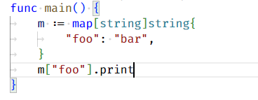
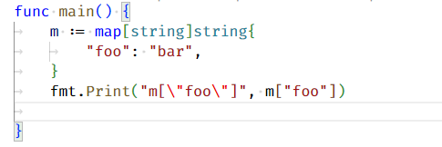
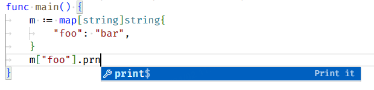

# Custom Postfix Completion

[中文版](#中文)

> This English document was translated from Chinese by ChatGPT. If there are any issues, please feel free to provide feedback to me.

## Overview

This extension provides custom postfix completion for Visual Studio Code, allowing users to tailor their own postfix completions for **any language**.

[Postfix completion](https://www.jetbrains.com/help/idea/settings-postfix-completion.html) is a coding aid that enables developers to quickly complete code snippets by typing short postfix words. This feature is common in JetBrains IDEs, but currently not available in Visual Studio Code. Although there are other extensions that offer postfix completion for specific languages, none provide a universal, customizable postfix completion for all languages, which is why I developed this extension.

## Example

I primarily use Go for development, and here is an example in Go (to reiterate: you can use this extension with any language):

Before postfix completion:



After postfix completion:



You can see that the `.print` postfix has been applied to the target (`m["foo"]`).

This extension also provides input suggestions, and when a suggestion is accepted, the effect is as shown above:



## Features

- For text in the format `target.triggerWord`, if the user has [customized](#custom-settings) a postfix completion with `triggerWord` as the trigger, then after the `custom-postfix-completion.apply-template` command is executed, the user's custom postfix completion will be applied to `target`. Users can bind this command to a keyboard shortcut (e.g., `Ctrl+Alt+.`) for quick application of postfix completion.
- For languages where the user has defined postfix completions, suggestions are provided during input, and when a suggestion is accepted, the postfix completion is also applied.

## Commands

This extension defines the following Visual Studio Code commands:
- `custom-postfix-completion.apply-template`: Parses and applies the postfix completion before the cursor.

## Installation

The name of this extension is Custom Postfix Completion. You can search for and install it in Visual Studio Code, or go to the [Extension Marketplace](https://marketplace.visualstudio.com/items?itemName=JoeyWang.custom-postfix-completion) to download (Download Extension) and manually install it.

If you still encounter any issues, please refer to this [tutorial](https://code.visualstudio.com/learn/get-started/extensions).

## Custom Settings

This extension does not provide any predefined postfix completions for any language, which means that users need to customize them on their own. In the Visual Studio Code settings (`settings.json`), use the following configuration to customize postfix completions:

```json
"custom-postfix-completion": {
    "languageTemplates": {
        "go": {
            "templates": [
                {
                    "triggerWord": "print",
                    "description": "Print it",
                    "targetRegExp": "[^\\t]+",
                    "body": [
                        "fmt.Print(\"${foobar:escapeString(target)}\", ${target})",
                        ""
                    ]
                }
            ]
        }
    }
}
```
The detailed explanation for each part is as follows:
- `go`: The [LanguageId](https://code.visualstudio.com/docs/languages/identifiers) of the language you want to customize the postfix completion for.
- `templates`: In the configuration of this extension, a postfix completion is called a template, and `templates` is an array where users can customize multiple templates.
- Postfix completion template: Elements of the `templates`, which contain fields such as:
    - `triggerWord`: The trigger word for postfix completion. As the name suggests, the trigger word must be a "word" and can only contain English letters and numbers. The `triggerWord` in `target.triggerWord` is the trigger word, such as the `print` in the [example](#example).
    - `description`: The description of the postfix completion. It is displayed next to the options when suggestions are shown, like the `Print it` in the [example](#example).
    - `targetRegExp`: The target regular expression for postfix completion. It determines what `target` is in `target.triggerWord`. The default is `\w+`, which only matches a continuous sequence of English letters or numbers before `.triggerWord`.

        In some cases, this default value may not meet the needs. For example, for the `print` postfix that is used to print the entire line (`5 + 20.print`), the user may want `target` to be everything before `.print` (`5 + 20`) rather than just a sequence of letters or numbers (`20`). In this case, `targetRegExp` can be configured to a more appropriate regular expression. In this example, `[^\\t]+` is suitable (it matches everything except TAB characters at the beginning of the line).

        `targetRegExp` will never match `.triggerWord`; it only matches the content before `.triggerWord`.
    - `body`: The content of the postfix completion, that is, what `target.triggerWord` becomes after applying the postfix completion. It is an array type, with each element starting a new line after the postfix completion is applied. You can define "variables" within it, see the [next section](#variables) for details.

### Variables

In the `body` of a *postfix completion template*, you can define "variables" in the `${...}` format: they will be assigned a specific value when the postfix completion is applied, or allow the user to press the Tab key to jump between variables in sequence for input after applying the postfix completion (known as "**user interaction**", similar to the [Tabstops](https://code.visualstudio.com/docs/editor/userdefinedsnippets#_tabstops) feature of code snippets, but with a different definition format).

The complete format of variables is: `${NAME#NO:EXPRESSION(target):DEFAULT_VALUE}`.
- `NAME`: The name of the variable. When `NAME` is `target`, it indicates that the value of the variable is the text of `target` in `target.triggerWord`. Multiple variables with the same `NAME` do not have special functionality.
- `NO`: The sequence number of the variable. The numbers determine the order of *user interaction*, from smallest to largest.

    Variables without `#NO` do not require *user interaction*, meaning the user pressing the Tab key will not jump to these variables.

    Variables with the same `NO` are treated as the same variable, and after applying the postfix completion, the user can edit them simultaneously.

    The number 0 indicates the end point of *user interaction*. A *postfix completion template* may contain at most one variable with the sequence number 0. If there is no variable with the number 0, *user interaction* will end at the end of the `body` of the *postfix completion template*.
- `EXPRESSION(target)`: An expression used to calculate the default value of the variable. Due to limitations of the Visual Studio Code API, the parameter of `EXPRESSION(target)` can only be `target`, not the `NAME` of other variables (☹️). Currently, the supported `EXPRESSION` is:
    - `escapeString`: Escapes double quotes `"` in the parameter to `\"` to safely include it in a string.
- `DEFAULT_VALUE`: The default value of the variable. When both `EXPRESSION(target)` and `DEFAULT_VALUE` exist, `EXPRESSION(target)` takes precedence.

Optional rules for each part:
- `NAME` is required.
- When `#NO` is absent, since the variable will be skipped in *user interaction*, it must be able to be assigned a default text by this extension, so it must meet one of the following conditions:
    - `NAME` is `target`, with the default value being the text of `target` in `target.triggerWord`.
    - Includes `EXPRESSION(target)`.
    - Includes `DEFAULT_VALUE`.
- If `DEFAULT_VALUE` is absent, the preceding colon `:` should not exist.
- If both `EXPRESSION(target)` and `DEFAULT_VALUE` are absent, both colons `:` should not exist.
- If `EXPRESSION(target)` is absent but `DEFAULT_VALUE` exists, there should be two colons `:` preceding the `DEFAULT_VALUE`.

### Explanation of the Configuration Above

Now that all the rules have been introduced, let's see what the configuration at the beginning of the [Custom Settings](#custom-settings) means:
```json
{
    "triggerWord": "print",
    "description": "Print it",
    "targetRegExp": "[^\\t]+",
    "body": [
        "fmt.Print(\"${foobar:escapeString(target)}\", ${target})",
        ""
    ]
}
```
- `"triggerWord": "print"`: The trigger word for this template is `print`.
- `"targetRegExp": "[^\\t]+"`: The target for this template is all the continuous non-tab characters in front of `.print`, usually the entire line of content.
- `body: ...`: The `body` of this template contains two variables in the first line and ends on the second line. The two variables are described as follows:
    - `${foobar:escapeString(target)}`: This variable skips *user interaction*, and its default value is the result of `escapeString` escaping on target.
    - `${target}`: This variable skips *user interaction*, and its default value is the text of the target.

Together, they enable the postfix completion effect demonstrated in the [Example](#example).

## Release Notes

### 1.0.1

Initial release, implemented postfix completion and code suggestions.

### 1.0.2

Improved README, icon.

## Acknowledgments

This extension is greatly inspired by [Custom Postfix Templates](https://github.com/xylo/intellij-postfix-templates#custom-postfix-templates-for-intellij-idea), a plugin that enhances postfix completion functionality for JetBrains IDEs.

# 中文

## 概述

本拓展为 Visual Studio Code 提供自定义后缀补全功能，允许用户为**任何语言**定制自己的后缀补全。

[后缀补全](https://www.jetbrains.com/help/idea/settings-postfix-completion.html)是一种编程辅助，使开发者能够通过键入简短的后缀词语来快速完成代码片段。该功能在 JetBrains IDE 中很常见，但 Visual Studio Code 目前没有这样的功能，虽然有其他拓展提供了针对特定语言的后缀补全功能，但没有一个拓展能够为所有语言提供通用的、自定义的后缀补全功能，所以我开发了这个拓展。

## 示例

我主要使用 Go 语言开发，下面是一个 Go 语言的使用示例（再次强调：你可以在任何语言上使用这个拓展）：

后缀补全前：


后缀补全后：


可以看到`.print`后缀被应用在目标（`m["foo"]`）上了。

本拓展也提供输入建议，建议被接受时效果同上：


## 特性

- 对`target.triggerWord`这种格式的文本，如果用户[自定义](#自定义设置)了以`triggerWord`为触发词的后缀补全，那么在`custom-postfix-completion.apply-template`命令被执行后，将会把用户自定义的后缀补全应用到`target`上。用户可以把该命令绑定到快捷键上（比如`Ctrl+Alt+.`）来快速应用后缀补全。
- 对于用户自定了后缀补全的语言，提供输入时建议，当用户接受建议时，后缀补全也能被应用。

## 命令

本拓展定义了如下 Visual Studio Code 命令：
- `custom-postfix-completion.apply-template`: 解析并应用光标前的后缀补全。

## 安装

本拓展的名字是 Custom Postfix Completion，你可以在 Visual Studio Code 搜索并安装，或者到[拓展市场](https://marketplace.visualstudio.com/items?itemName=JoeyWang.custom-postfix-completion)下载（Download Extension）并手动安装。

如果仍有问题，请参考这个[教程](https://code.visualstudio.com/learn/get-started/extensions)。

## 自定义设置

本拓展不为任何语言提供任何预定义的后缀补全，也就是说，用户需要自行定制它们。在 Visual Studio Code 配置（`settings.json`）中，使用如下配置来自定义后缀补全：
```json
"custom-postfix-completion": {
    "languageTemplates": {
        "go": {
            "templates": [
                {
                    "triggerWord": "print",
                    "description": "Print it",
                    "targetRegExp": "[^\\t]+",
                    "body": [
                        "fmt.Print(\"${foobar:escapeString(target)}\", ${target})",
                        ""
                    ]
                }
            ]
        }
    }
}
```
其中每个部分的详细说明如下：
- go：你想要为其自定义后缀补全的语言的 [LanguageId](https://code.visualstudio.com/docs/languages/identifiers)
- templates: 在本拓展配置中，一个后缀补全被称为一个模板（template），`templates`是一个数组，用户可以自定义多个模板。
- 后缀补全模板：`templates`的元素，包含这样一些字段：
    - triggerWord: 后缀补全的触发词。顾名思义，触发词必须是一个“词”，只能包含英文字母、数字。`target.triggerWord`中的`triggerWord`就是触发词，例如[示例](#示例)中的`print`。
    - description: 后缀补全的描述。展示输入时建议时会展示在选项旁边，例如[示例](#示例)中的`Print it`。
    - targetRegExp: 后缀补全的目标匹配正则表达式。它决定了`target.triggerWord`中`target`是什么。默认为`\w+`，即只匹配`.triggerWord`前面的一个连续的英文字母或数字。

      有些情况下，这个默认值可能不满足需求，比如对于`print`这个用来打印整行的后缀匹配（`5 + 20.print`），用户可能希望`target`是`.print`前面的所有内容（`5 + 20`）而不只是一个连续的英文字母或数字（`20`），此时可以将`targetRegExp`配置为更合适的正则表达式，在这个例子中，`[^\\t]+`就很合适（它匹配除了行头 TAB 符以外的所有内容）。

      `targetRegExp`无论如何不会匹配`.triggerWord`，它只匹配`.triggerWord`前面的内容。
    - body: 后缀补全的内容，即`target.triggerWord`在应用后缀补全后所变成的内容。数组类型，每个元素在应用后缀补全后另起一行。其中可以定义“变量”，详见[下一节](#变量)。

### 变量

在*后缀补全模板*的`body`中，可以定义`${...}`格式的“变量”：在应用后缀补全时会被赋予特定的值，或者在应用后缀补全后允许用户按 Tab 键在变量之间按顺序跳转输入（称为“**用户交互**”，和代码片段的[Tabstops](https://code.visualstudio.com/docs/editor/userdefinedsnippets#_tabstops)功能相同，只是定义格式不同）。

变量的完整格式为：`${NAME#NO:EXPRESSION(target):DEFAUL_VALUE}`。
- NAME：变量的名字。当`NAME`为`target`时，表示该变量取值`target.triggerWord`中`target`的文本。多个变量`NAME`相同没有特殊功能。
- NO：该变量的序号。序号为*用户交互*的顺序，从小到大。

    不包含`#NO`的变量是不需要*用户交互*的，也就是说，用户按 Tab 键不会跳转到这种变量上。

    `NO`存在且相同的变量被视为同一个变量，应用后缀补全后，用户可以同时编辑它们。

    序号 0 表示*用户交互*的终点，一个*后缀补全模板*最多包含一个序号 0 的变量，如果不包含序号 0 的变量，*用户交互*会在*后缀补全模板*的`body`末尾结束。
- EXPRESSION(target)：用于计算该变量默认值的表达式。由于 Visual Studio Code API 限制，`EXPRESSION(target)`的参数只能是`target`，不能是其他变量的`NAME`（☹️）。目前支持的`EXPRESSION`有：
    - `escapeString`：将参数中的双引号`"`转义为`\"`，以便能将其安全地放进字符串中。
- DEFAUL_VALUE：变量默认值。`EXPRESSION(target)`和`DEFAUL_VALUE`都存在时，以`EXPRESSION(target)`优先。

各部分可选规则：
- `NAME`必须
- 当`#NO`不存在时，由于该变量将会被跳过*用户交互*，它必须能够被本拓展赋予默认文本，所以它必须符合以下几种情况之一：
    - `NAME`为`target`，默认值就是`target.triggerWord`中`target`的文本
    - 包含`EXPRESSION(target)`
    - 包含`DEFAUL_VALUE`
- `DEFAUL_VALUE`不存在时，他前面的冒号`:`也不能存在
- `EXPRESSION(target)`和`DEFAUL_VALUE`都不存在时，两个冒号`:`都不能存在
- `EXPRESSION(target)`不存在而`DEFAUL_VALUE`存在时，`DEFAUL_VALUE`前面有两个冒号`:`

### 解释上方的配置

现在，所有规则都介绍完了，我们来看一下[自定义设置](#自定义设置)开头的配置是什么意思：
```json
{
    "triggerWord": "print",
    "description": "Print it",
    "targetRegExp": "[^\\t]+",
    "body": [
        "fmt.Print(\"${foobar:escapeString(target)}\", ${target})",
        ""
    ]
}
```
- `"triggerWord": "print"`：该模板触发词是`print`
- `"targetRegExp": "[^\\t]+"`：该模板的 target 是`.print`前面的所有连续的非 Tab 符，通常是整行内容。
- `body: ...`：该模板的`body`在第一行中包含两个变量，结束于第二行。两个变量的说明如下：
    - `${foobar:escapeString(target)}`：该变量跳过*用户交互*，默认值是对 target 进行 `escapeString`转义的结果
    - `${target}`：该变量跳过*用户交互*，默认值为 target 的文本

它们共同使得[示例](#示例)中的后缀补全效果得以实现。

## 发布记录

### 1.0.1

首次发布，实现了后缀补全和代码建议

### 1.0.2

完善 README、图标

## 鸣谢

本拓展很大程度上受到 [Custom Postfix Templates](https://github.com/xylo/intellij-postfix-templates#custom-postfix-templates-for-intellij-idea) 的启发，它是一个为 JetBrains IDE 增强后缀补全功能的插件。
